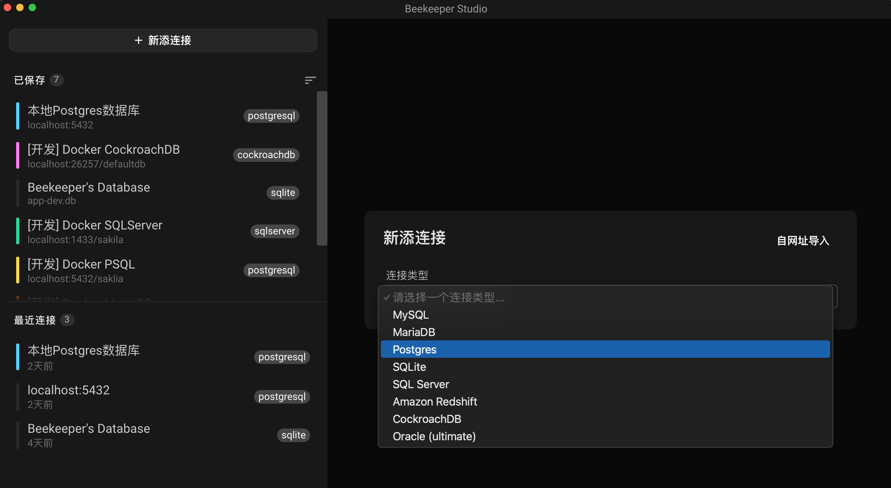

# Beekeeper Studio (社区版)

Beekeeper Studio 是一个跨平台的数据库GUI管理工具和SQL编辑器，可用于Linux、macOS和Windows。Beekeeper Studio社区版使用GPL通用公共许可证，因此它自由开放与免费使用。

本仓基于[Beekeeper Studio](https://github.com/beekeeper-studio/beekeeper-studio)进行翻译而不作任何功能改动，此Repo目的是让欲使用Beekeeper Studio中文界面用户爱好者更方便地使用此数据库GUI管理工具。




## Beekeeper Studio 版本

1. **Beekeeper Studio 社区版** - 开源版本：它是一个功能齐全的数据库管理客户端，完全免费和开源。

2. **Beekeeper Studio 终极版** - 商业版本：具有额外功能，并提供商业友好的商业许可证。购买终极版是支持Beekeeper Studio 的最佳方式。

👉 [两个版本对比](https://beekeeperstudio.io/get)


## 功能特色

亮眼功能: 流畅🍫、快速🏎，而且您会真正享受使用它的乐趣🥰

- 真正跨平台: Windows、MacOS与Linux都能使用
- 具有语法高亮的自动补全SQL查询编辑器
- 标签页/选项卡式界面，让您可多任务处理
- 对表格数据进行排序和筛选，以找到您的内容所需
- 方便易用的键盘快捷键
- 保存查询以备后用
- 查询运行记录，您可以快速使用一个您在几天前或几个月前工作的查询
- 默认深色主题界面

本软件开发者对其他开源SQL编辑器和数据库管理器的不满之一是；他们对功能采取了“[厨房水槽](https://blog.csdn.net/lovelyelfpop/article/details/76099211)”的方法，添加了太多功能，以至于UI变得混乱且难以导航。我们想要一个外观漂亮、功能强大且易于使用的开源SQL工作台。一直找不到，所以我们创建了Beekeeper Studio！

Beekeeper Studio 支持连接以下数据库：

- SQLite
- MySQL
- MariaDB
- Postgres
- CockroachDB
- SQL Server
- Amazon Redshift

## 文档

英文文档：[docs.beekeeperstudio.io](https://docs.beekeeperstudio.io)，中文文档将于后续更新放出。

## License

Beekeeper Studio Community Edition (the code in this repository) is licensed under the GPLv3 license.

Beekeeper Studio Ultimate Edition contains extra features and is licensed under a [commercial end user agreement (EULA)](https://beekeeperstudio.io/legal/commercial-eula/).

Beekeeper Studio's trademarks (words marks and logos) are not open source. See our [trademark guidelines](https://beekeeperstudio.io/legal/trademark/) for more information.

## Trademark Guidelines

Trademarks can be complicated with open source projects, so we have adapted a set of standard guidelines for using our trademarks that are common to many open source projects.

If you are just using the Beekeeper Studio app, and you are not forking or distributing Beekeeper Studio code in any way, these probably don't apply to you.

👉 [Beekeeper Studio Trademark Guidelines](https://beekeeperstudio.io/legal/trademark/)

## Contributing to Beekeeper Studio

We love *any* community engagement. Even if you're complaining because you don't like something about the app!


### Contributor Agreements

- Building an inclusive and welcoming community is important to us, so please follow our [code of conduct](code_of_conduct.md) as you engage with the project.

- By contributing to the project you agree to the terms of our [contributor guidelines](CONTRIBUTING.md).


### 编译

```bash

cd beekeeper-studio/
yarn install
yarn run electron:serve

```

## Big Thanks

Beekeeper Studio wouldn't exist without [Sqlectron-core](https://github.com/sqlectron/sqlectron-core), the core database libraries from the [Sqlectron project](https://github.com/sqlectron/sqlectron-gui). Beekeeper Studio started as an experimental fork of that repository. A big thanks to @maxcnunes and the rest of the Sqlectron community.

The original license from sqlectron-core is included here:

```
Copyright (c) 2015 The SQLECTRON Team

Permission is hereby granted, free of charge, to any person obtaining
a copy of this software and associated documentation files (the
'Software'), to deal in the Software without restriction, including
without limitation the rights to use, copy, modify, merge, publish,
distribute, sublicense, and/or sell copies of the Software, and to
permit persons to whom the Software is furnished to do so, subject to
the following conditions:

The above copyright notice and this permission notice shall be
included in all copies or substantial portions of the Software.

THE SOFTWARE IS PROVIDED 'AS IS', WITHOUT WARRANTY OF ANY KIND,
EXPRESS OR IMPLIED, INCLUDING BUT NOT LIMITED TO THE WARRANTIES OF
MERCHANTABILITY, FITNESS FOR A PARTICULAR PURPOSE AND NONINFRINGEMENT.
IN NO EVENT SHALL THE AUTHORS OR COPYRIGHT HOLDERS BE LIABLE FOR ANY
CLAIM, DAMAGES OR OTHER LIABILITY, WHETHER IN AN ACTION OF CONTRACT,
TORT OR OTHERWISE, ARISING FROM, OUT OF OR IN CONNECTION WITH THE
SOFTWARE OR THE USE OR OTHER DEALINGS IN THE SOFTWARE.
```
